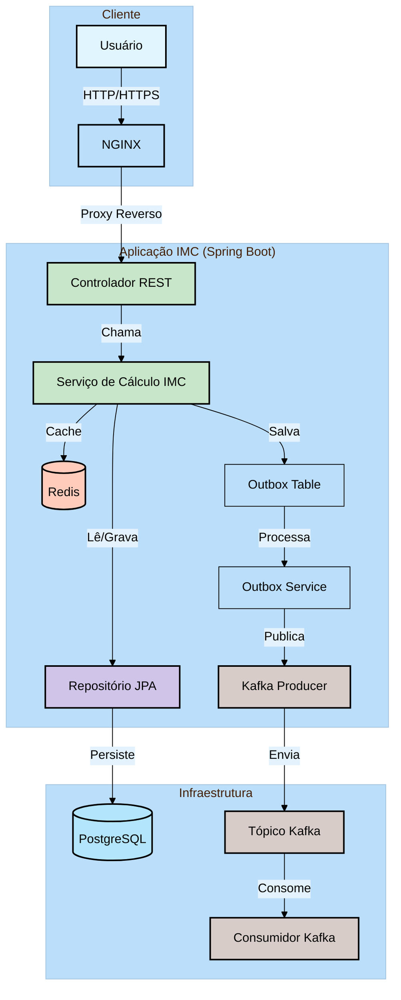

# Calculadora de IMC (Índice de Massa Corporal)

Este é um projeto de API RESTful para cálculo de IMC (Índice de Massa Corporal) desenvolvido com Spring Boot. O sistema permite calcular o IMC de usuários, armazenar o histórico de cálculos e fornecer análises.

## 🚀 Tecnologias

- **Backend**: Java 17, Spring Boot 3.x
- **Banco de Dados**: PostgreSQL
- **Cache**: Redis
- **Mensageria**: Apache Kafka
- **Proxy Reverso**: NGINX
- **Containerização**: Docker e Docker Compose
- **Gerenciamento de Dependências**: Maven

## 📋 Pré-requisitos

- Docker e Docker Compose instalados
- Java 17 ou superior
- Maven 3.6+ (opcional, para build local)

## 🛠️ Configuração do Ambiente

1. **Variáveis de Ambiente**
   - Crie um arquivo `.env` na raiz do projeto ou use os arquivos na pasta `env/`
   - Configure as variáveis necessárias para o banco de dados e outras dependências

2. **Banco de Dados**
   - O PostgreSQL será executado em um container Docker
   - Os dados são persistidos em um volume Docker chamado `postgres-data`

## 🚀 Executando o Projeto

### Com Docker Compose (Recomendado)

```bash
# Construir e iniciar todos os serviços
docker-compose up -d --build

# Verificar logs
docker-compose logs -f

# Parar todos os serviços
docker-compose down
```

### Sem Docker

1. Certifique-se de ter um servidor PostgreSQL rodando
2. Configure as variáveis de ambiente necessárias
3. Execute:
   ```bash
   mvn spring-boot:run
   ```

## 🌐 Endpoints da API

### Calcular IMC
- **POST** `/bmi/calculate`
  - Calcula o IMC com base nos dados fornecidos
  
  **Exemplo de Requisição:**
  ```json
  {
      "nome": "João",
      "altura": 1.75,
      "peso": 70
  }
  ```

  **Resposta de Sucesso (200 OK):**
  ```json
  {
      "id": "12345abcde",
      "nome": "João",
      "altura": 1.75,
      "peso": 70.0,
      "imc": 22.86
  }
  ```

### Histórico de Cálculos
- **GET** `/bmi/history`
  - Retorna todo o histórico de cálculos armazenados

  **Resposta de Sucesso (200 OK):**
  ```json
  [
      {
          "id": "12345abcde",
          "nome": "João",
          "altura": 1.75,
          "peso": 70.0,
          "imc": 22.86
      },
      {
          "id": "67890fghij",
          "nome": "Maria",
          "altura": 1.65,
          "peso": 60.0,
          "imc": 22.04
      }
  ]
  ```

## 📊 Categorias de IMC

| IMC | Categoria |
|-----|-----------|
| Abaixo de 18.5 | Abaixo do peso |
| 18.5 - 24.9 | Peso normal |
| 25.0 - 29.9 | Sobrepeso |
| 30.0 - 34.9 | Obesidade Grau I |
| 35.0 - 39.9 | Obesidade Grau II |
| 40.0 ou mais | Obesidade Grau III |

## 📦 Estrutura do Projeto

```
imc-application/
├── src/
│   ├── main/
│   │   ├── java/com/danielsilva/imcapplication/
│   │   │   ├── config/       # Configurações do Spring
│   │   │   ├── controller/   # Controladores REST
│   │   │   ├── model/        # Entidades JPA
│   │   │   ├── repository/   # Repositórios Spring Data
│   │   │   ├── service/      # Lógica de negócios
│   │   │   └── ImcApplication.java
│   │   └── resources/
│   │       ├── application.yml
│   │  
│   └── test/                 # Testes unitários e de integração
├── docker/
│   └── nginx/             # Configurações do NGINX
├── env/                     # Arquivos de ambiente
├── .gitignore
├── docker-compose.yml
├── Dockerfile
└── pom.xml
```

## 🔍 Monitoramento e Logs

- **Logs da Aplicação**: Consulte os logs com `docker-compose logs -f imc`


## Componentes da Arquitetura





## 🤝 Contribuição

1. Faça um fork do projeto
2. Crie uma branch para sua feature (`git checkout -b feature/AmazingFeature`)
3. Commit suas alterações (`git commit -m 'Add some AmazingFeature'`)
4. Push para a branch (`git push origin feature/AmazingFeature`)
5. Abra um Pull Request

## 📄 Licença

Este projeto está sob a licença MIT - veja o arquivo [LICENSE](LICENSE) para detalhes.

---

Desenvolvido por Daniel Silva - daniel97silva.ds@gmail.com

