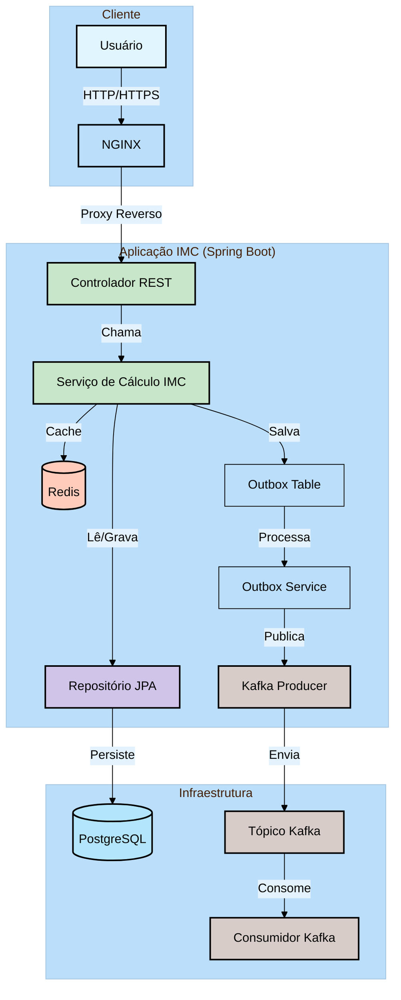

# Diagrama de Arquitetura da Aplicação IMC



## Descrição dos Componentes

### Cliente
- **Usuário**: Acessa a aplicação através de um navegador web
- **NGINX**: Servidor web que atua como proxy reverso para a aplicação

### Aplicação IMC (Spring Boot)
- **Controlador REST**: Recebe as requisições HTTP e as direciona para o serviço apropriado
- **Serviço de Cálculo IMC**: Contém a lógica de negócio para cálculo do IMC
- **Repositório JPA**: Gerencia o acesso aos dados no banco de dados
- **Redis**: Cache para melhorar o desempenho das consultas frequentes
- **Tabela Outbox**: Armazena mensagens que precisam ser enviadas para o Kafka em uma transação atômica
- **Outbox Service**: Processa mensagens pendentes na tabela Outbox e as envia para o Kafka
- **Kafka Producer**: Envia mensagens para o sistema de mensageria

### Infraestrutura
- **PostgreSQL**: Banco de dados relacional para armazenamento persistente
- **Tópico Kafka**: Fila de mensagens para processamento assíncrono
- **Consumidor Kafka**: Processa as mensagens do tópico Kafka

## Padrão Outbox
O sistema implementa o padrão Outbox para garantir a entrega confiável de mensagens ao Kafka. Este padrão garante que as mensagens sejam entregues mesmo em caso de falhas na aplicação.

### Fluxo do Padrão Outbox:
1. **Armazenamento na Tabela Outbox**:
   - Quando um evento precisa ser publicado, ele é primeiro salvo na tabela Outbox dentro da mesma transação do banco de dados
   - Isso garante atomicidade entre a operação de negócio e o registro da mensagem

2. **Processamento Assíncrono**:
   - O Outbox Service verifica periodicamente a tabela Outbox por mensagens não processadas
   - Para cada mensagem não processada, o serviço tenta publicá-la no Kafka
   - Após publicação bem-sucedida, a mensagem é marcada como processada

3. **Tolerância a Falhas**:
   - Se o Kafka estiver indisponível, as mensagens permanecem na tabela Outbox
   - O serviço continuará tentando enviar as mensagens em intervalos regulares
   - O processamento é idempotente, então mensagens duplicadas não causam problemas

## Fluxo de Dados
1. O usuário acessa a aplicação através do navegador
2. O NGINX faz o proxy reverso para a aplicação Spring Boot
3. O Controlador REST recebe a requisição e a encaminha para o Serviço
4. O Serviço pode:
   - Consultar o cache (Redis) para respostas em cache
   - Acessar o banco de dados através do Repositório JPA
   - Salvar mensagens na tabela Outbox para processamento assíncrono
5. O Outbox Service processa as mensagens pendentes e as publica no Kafka
6. O Consumidor Kafka processa as mensagens do tópico conforme necessário

## Diagrama Detalhado do Padrão Outbox

```mermaid
%%{init: {
    'theme': 'base',
    'themeVariables': {
        'primaryColor': '#1976D2',
        'primaryTextColor': '#FFFFFF',
        'primaryBorderColor': '#0D47A1',
        'lineColor': '#546E7A',
        'secondaryColor': '#42A5F5',
        'tertiaryColor': '#E3F2FD',
        'noteBkgColor': '#FFF9C4',
        'noteTextColor': '#000000',
        'fontFamily': 'Arial, sans-serif'
    },
    'themeConfig': {
        'fontSize': '14px',
        'noteMargin': 15
    },
    'sequence': {
        'boxMargin': 10,
        'boxTextMargin': 5,
        'noteMargin': 10,
        'messageMargin': 35,
        'mirrorActors': false,
        'bottomMarginAdj': 1,
        'useMaxWidth': true,
        'rightAngles': false,
        'showSequenceNumbers': false,
        'actorFontSize': 14,
        'actorFontFamily': 'Arial, sans-serif',
        'actorFontWeight': 'bold',
        'noteFontSize': 13,
        'noteFontFamily': 'Arial, sans-serif',
        'messageFontSize': 14,
        'messageFontFamily': 'Arial, sans-serif',
        'wrap': true,
        'width': 150,
        'height': 100
    }
}}%%

gantt
    title Fluxo do Padrão Outbox
    dateFormat  HH:mm:ss
    axisFormat %H:%M:%S
    
    section 1. Publicação do Evento
    Cliente → Serviço         : 00:00:00, 5s
    Serviço → Banco de Dados  : 00:00:01, 4s
    
    section 2. Processamento Assíncrono
    Outbox Service verifica   : 00:00:05, 2s
    Envio para Kafka         : 00:00:07, 3s
    Atualização do Status    : 00:00:10, 2s
    
    section 3. Consumo
    Kafka → Consumidor        : 00:00:12, 4s
    Confirmação              : 00:00:16, 2s
```



```mermaid
%%{init: {
    'theme': 'default',
    'themeVariables': {
        'primaryColor': '#1976D2',
        'primaryTextColor': '#FFFFFF',
        'primaryBorderColor': '#0D47A1',
        'lineColor': '#546E7A',
        'secondaryColor': '#42A5F5',
        'tertiaryColor': '#E3F2FD',
        'noteBkgColor': '#FFF9C4',
        'noteTextColor': '#000000',
        'fontFamily': 'Arial, sans-serif'
    },
    'themeConfig': {
        'fontSize': '14px',
        'noteMargin': 15
    },
    'sequence': {
        'boxMargin': 10,
        'boxTextMargin': 5,
        'noteMargin': 10,
        'messageMargin': 35,
        'mirrorActors': false,
        'bottomMarginAdj': 1,
        'useMaxWidth': true,
        'rightAngles': false,
        'showSequenceNumbers': false,
        'actorFontSize': 14,
        'actorFontFamily': 'Arial, sans-serif',
        'actorFontWeight': 'bold',
        'noteFontSize': 13,
        'noteFontFamily': 'Arial, sans-serif',
        'messageFontSize': 14,
        'messageFontFamily': 'Arial, sans-serif',
        'wrap': true,
        'width': 150,
        'height': 100
    }
}}%%

sequenceDiagram
    box rgb(200, 230, 255) Fluxo Principal
        participant C as Cliente
        participant S as Serviço
        participant DB as Banco de Dados
    end
    
    box rgb(230, 255, 230) Processamento Assíncrono
        participant OS as Outbox Service
        participant K as Kafka
        participant CON as Consumidor
    end
    
    %% Estilo dos participantes
    rect rgb(240, 240, 240)
        Note over C,S,DB,OS,K,CON: 1. Publicação do Evento (Síncrono)
        C->>+S: 1.1 Requisição (ex: Criar Cliente)
        S->>+DB: 1.2 Inicia Transação
        S->>+DB: 1.3 Salva Dados do Cliente
        S->>+DB: 1.4 Salva Evento na Tabela Outbox
        DB-->>-S: 1.5 Confirma
        S-->>-C: 1.6 Resposta de Sucesso (200 OK)
    end
    
    rect rgb(255, 255, 230)
        Note over OS,K: 2. Processamento Assíncrono (A cada 5s)
        loop A cada 5 segundos
            OS->>+DB: 2.1 Busca mensagens não processadas
            DB-->>-OS: 2.2 Retorna mensagens pendentes
            
            loop Para cada mensagem
                OS->>+K: 2.3 Envia para o tópico 'imc'
                alt Sucesso
                    K-->>-OS: 2.4 ACK Recebido
                    OS->>+DB: 2.5 Atualiza status para 'PROCESSADO'
                    DB-->>-OS: 2.6 Confirma
                else Falha
                    OS->>OS: 2.7 Agenda nova tentativa (backoff exponencial)
                end
            end
        end
    end
    
    rect rgb(230, 255, 240)
        Note over K,CON: 3. Consumo da Mensagem
        K->>+CON: 3.1 Entrega mensagem
        CON->>CON: 3.2 Processa mensagem
        alt Sucesso
            CON-->>-K: 3.3 Confirma processamento (commit)
        else Falha
            CON-->>-K: 3.4 Rejeita mensagem (será reentregue)
        end
    end

    %% Notas de rodapé
    Note right of K: 🔄 Em caso de falha na entrega, o Kafka
    Note right of K: reenvia a mensagem após o timeout
    
    Note left of DB: 💾 Transação atômica garante que
    Note left of DB: ou tudo é salvo, ou nada é salvo

### Legenda do Diagrama:
1. **Fluxo de Publicação de Evento**:
   - O cliente faz uma requisição ao serviço
   - O serviço salva os dados e o evento na mesma transação
   - O cliente recebe confirmação imediata

2. **Processamento Assíncrono**:
   - O Outbox Service verifica periodicamente por novas mensagens
   - Processa cada mensagem e tenta enviar para o Kafka
   - Atualiza o status da mensagem após envio bem-sucedido
   - Em caso de falha, agenda nova tentativa

3. **Consumo da Mensagem**:
   - O Kafka entrega a mensagem ao consumidor
   - O consumidor processa a mensagem e confirma
   - Se o processamento falhar, o Kafka reenvia a mensagem

## Fluxograma Vertical do Padrão Outbox

```mermaid
%%{init: {
    'theme': 'default',
    'themeVariables': {
        'primaryColor': '#1976D2',
        'primaryTextColor': '#FFFFFF',
        'primaryBorderColor': '#0D47A1',
        'lineColor': '#546E7A',
        'fontFamily': 'Arial, sans-serif',
        'nodeTextColor': '#263238',
        'clusterBkg': '#f5f5f5',
        'clusterBorder': '#e0e0e0',
        'fontSize': '14px',
        'edgeLabelBackground': '#ffffff',
        'edgeLabelStroke': 'none',
        'edgeLabelFontSize': '13px',
        'edgeLabelColor': '#455A64'
    },
    'themeConfig': {
        'fontSize': '14px',
        'nodeTextMargin': 5,
        'padding': 10
    },
    'flowchart': {
        'useMaxWidth': true,
        'htmlLabels': true,
        'curve': 'basis'
    }
}}%%

flowchart TD
    classDef client fill:#42A5F5,stroke:#1976D2,color:white,stroke-width:2px,rounded:8px
    classDef service fill:#66BB6A,stroke:#2E7D32,color:white,stroke-width:2px,rounded:8px
    classDef db fill:#FFA726,stroke:#EF6C00,color:white,stroke-width:2px,rounded:8px
    classDef kafka fill:#7E57C2,stroke:#4527A0,color:white,stroke-width:2px,rounded:8px
    classDef consumer fill:#26A69A,stroke:#00897B,color:white,stroke-width:2px,rounded:8px
    classDef note fill:#FFF9C4,stroke:#FFD54F,color:#5D4037,stroke-width:1px,rounded:4px,dashed
    classDef success fill:#E8F5E9,stroke:#66BB6A,color:#2E7D32,stroke-width:2px,rounded:8px
    classDef failure fill:#FFEBEE,stroke:#EF5350,color:#C62828,stroke-width:2px,rounded:8px
    
    %% Nós
    start([Início]):::client
    
    subgraph "1. Publicação do Evento"
        A[Cliente envia requisição]:::client
        B[Serviço recebe requisição]:::service
        C[Inicia transação]:::service
        D[Salva dados do cliente]:::service
        E[Salva evento na tabela Outbox]:::service
        F[Confirma transação]:::db
        G[Retorna sucesso ao cliente]:::service
    end
    
    subgraph "2. Processamento Assíncrono"
        H[Outbox Service verifica mensagens]:::service
        I[Busca mensagens não processadas]:::db
        J[Para cada mensagem]:::service
        K[Tenta enviar para Kafka]:::kafka
        
        L{{Sucesso?}}:::note
        
        M[Atualiza status para PROCESSADO]:::db
        N[Agenda nova tentativa]:::failure
    end
    
    subgraph "3. Consumo da Mensagem"
        O[Kafka entrega mensagem]:::kafka
        P[Consumidor processa]:::consumer
        
        Q{{Processou com sucesso?}}:::note
        
        R[Confirma processamento]:::success
        S[Rejeita mensagem]:::failure
    end
    
    %% Conexões
    start --> A
    
    A --> B --> C --> D --> E --> F --> G
    
    H --> I --> J --> K --> L
    
    L -->|Sim| M
    L -->|Não| N
    N --> H
    
    K --> O --> P --> Q
    
    Q -->|Sim| R
    Q -->|Não| S
    S --> O
    
    %% Estilo dos subgrafos
    style 1 stroke:#1976D2,stroke-width:2px,fill:#E3F2FD,color:#0D47A1,stroke-dasharray: 5 5
    style 2 stroke:#2E7D32,stroke-width:2px,fill:#E8F5E9,color:#1B5E20,stroke-dasharray: 5 5
    style 3 stroke:#4527A0,stroke-width:2px,fill:#EDE7F6,color:#311B92,stroke-dasharray: 5 5
    
    %% Legenda
    legend[(
        ### Legenda:
        - Fluxo Principal
        - Processamento Assíncrono
        - Consumo de Mensagens
        - Sucesso
        - Falha/Retentativa
    )]
    
    class legend note
```

### Características do Fluxo:

1. **Publicação do Evento (Síncrono)**
   - Fluxo principal da aplicação
   - Transação atômica garante consistência
   - Resposta rápida ao cliente

2. **Processamento Assíncrono**
   - Executado em background
   - Tenta processar mensagens pendentes
   - Em caso de falha, agenda nova tentativa

3. **Consumo da Mensagem**
   - Entrega garantida pelo Kafka
   - Processamento idempotente
   - Reentrega automática em caso de falha
