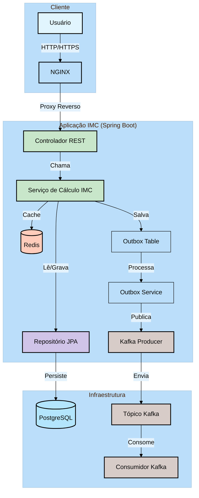

# Diagrama de Arquitetura da Aplicação IMC

## Descrição dos Componentes

### Cliente
- **Usuário**: Acessa a aplicação através de um navegador web
- **NGINX**: Servidor web que atua como proxy reverso para a aplicação

### Aplicação IMC (Spring Boot)
- **Controlador REST**: Recebe as requisições HTTP e as direciona para o serviço apropriado
- **Serviço de Cálculo IMC**: Contém a lógica de negócio para cálculo do IMC
- **Repositório JPA**: Gerencia o acesso aos dados no banco de dados
- **Redis**: Cache para melhorar o desempenho das consultas frequentes
- **Tabela Outbox**: Armazena mensagens que precisam ser enviadas para o Kafka em uma transação atômica
- **Outbox Service**: Processa mensagens pendentes na tabela Outbox e as envia para o Kafka
- **Kafka Producer**: Envia mensagens para o sistema de mensageria

### Infraestrutura
- **PostgreSQL**: Banco de dados relacional para armazenamento persistente
- **Tópico Kafka**: Fila de mensagens para processamento assíncrono
- **Consumidor Kafka**: Processa as mensagens do tópico Kafka

## Padrão Outbox
O sistema implementa o padrão Outbox para garantir a entrega confiável de mensagens ao Kafka. Este padrão garante que as mensagens sejam entregues mesmo em caso de falhas na aplicação.

### Fluxo do Padrão Outbox:
1. **Armazenamento na Tabela Outbox**:
   - Quando um evento precisa ser publicado, ele é primeiro salvo na tabela Outbox dentro da mesma transação do banco de dados
   - Isso garante atomicidade entre a operação de negócio e o registro da mensagem

2. **Processamento Assíncrono**:
   - O Outbox Service verifica periodicamente a tabela Outbox por mensagens não processadas
   - Para cada mensagem não processada, o serviço tenta publicá-la no Kafka
   - Após publicação bem-sucedida, a mensagem é marcada como processada

3. **Tolerância a Falhas**:
   - Se o Kafka estiver indisponível, as mensagens permanecem na tabela Outbox
   - O serviço continuará tentando enviar as mensagens em intervalos regulares
   - O processamento é idempotente, então mensagens duplicadas não causam problemas

## Fluxo de Dados
1. O usuário acessa a aplicação através do navegador
2. O NGINX faz o proxy reverso para a aplicação Spring Boot
3. O Controlador REST recebe a requisição e a encaminha para o Serviço
4. O Serviço pode:
   - Consultar o cache (Redis) para respostas em cache
   - Acessar o banco de dados através do Repositório JPA
   - Salvar mensagens na tabela Outbox para processamento assíncrono
5. O Outbox Service processa as mensagens pendentes e as publica no Kafka
6. O Consumidor Kafka processa as mensagens do tópico conforme necessário

## Diagrama Detalhado do Padrão Outbox

```mermaid
%%{init: {
    'theme': 'base',
    'themeVariables': {
        'primaryColor': '#1976D2',
        'primaryTextColor': '#FFFFFF',
        'primaryBorderColor': '#0D47A1',
        'lineColor': '#546E7A',
        'secondaryColor': '#42A5F5',
        'tertiaryColor': '#E3F2FD',
        'noteBkgColor': '#FFF9C4',
        'noteTextColor': '#000000',
        'fontFamily': 'Arial, sans-serif'
    },
    'themeConfig': {
        'fontSize': '14px',
        'noteMargin': 15
    },
    'sequence': {
        'boxMargin': 10,
        'boxTextMargin': 5,
        'noteMargin': 10,
        'messageMargin': 35,
        'mirrorActors': false,
        'bottomMarginAdj': 1,
        'useMaxWidth': true,
        'rightAngles': false,
        'showSequenceNumbers': false,
        'actorFontSize': 14,
        'actorFontFamily': 'Arial, sans-serif',
        'actorFontWeight': 'bold',
        'noteFontSize': 13,
        'noteFontFamily': 'Arial, sans-serif',
        'messageFontSize': 14,
        'messageFontFamily': 'Arial, sans-serif',
        'wrap': true,
        'width': 150,
        'height': 100
    }
}}%%

gantt
    title Fluxo do Padrão Outbox
    dateFormat  HH:mm:ss
    axisFormat %H:%M:%S
    
    section 1. Publicação do Evento
    Cliente → Serviço         : 00:00:00, 5s
    Serviço → Banco de Dados  : 00:00:01, 4s
    
    section 2. Processamento Assíncrono
    Outbox Service verifica   : 00:00:05, 2s
    Envio para Kafka         : 00:00:07, 3s
    Atualização do Status    : 00:00:10, 2s
    
    section 3. Consumo
    Kafka → Consumidor        : 00:00:12, 4s
    Confirmação              : 00:00:16, 2s
```

